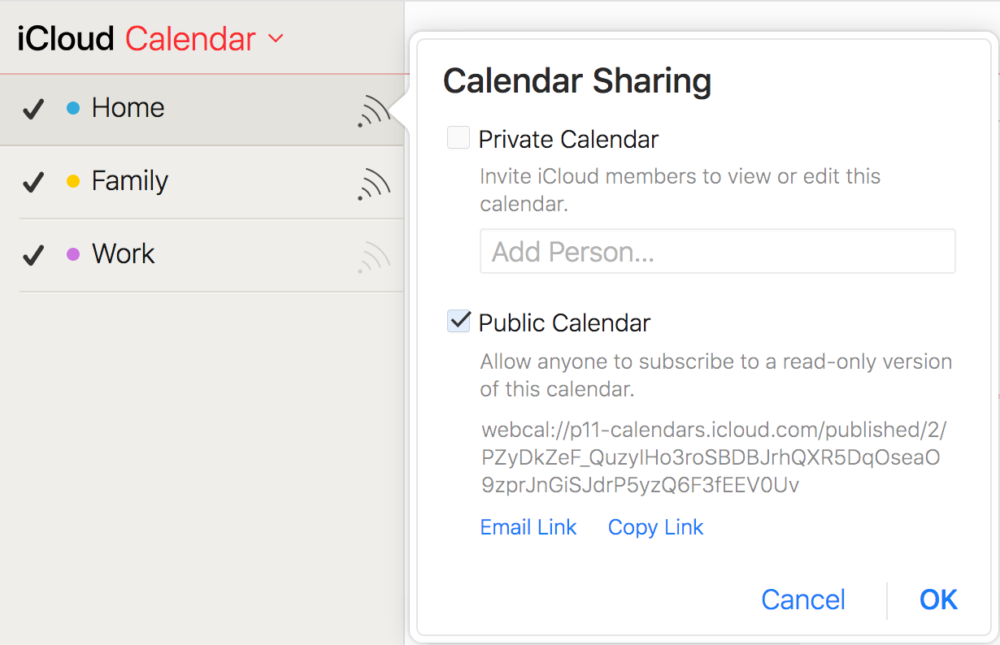

Tasks can synchronize data using iCloud's CalDAV interface. After setting up
iCloud synchronization you can access your tasks at
[icloud.com/reminders](https://www.icloud.com/reminders) or by using the Apple
Reminders app on an [iPhone, iPad, iPod
Touch](https://support.apple.com/en-us/HT205890), or
[macOS](https://support.apple.com/guide/reminders/welcome/mac) device. You will
also be able to [share your lists](https://support.apple.com/kb/PH12516) with
other iCloud users.

**The new Apple Reminders app introduced in iOS 13 and macOS 10.15 uses a
proprietary format that is _not_ compatible with Tasks. You can continue to
synchronize Tasks with iCloud, however once you upgrade your Apple Reminders
app you will no longer see Tasks data in iOS 13+, macOS 10.15+, or at
iCloud.com**

### Prepare your iCloud account

**An iPhone, iPad, iPod Touch, or macOS device is required to enable iCloud
Calendar and two-factor authentication**

* Register for a free account at [icloud.com](https://www.icloud.com)
* [Enable two-factor authentication](https://support.apple.com/en-us/HT204915)
* [Enable iCloud Calendar](https://support.apple.com/en-us/HT208681)

### Generate an app-specific password

Third party apps must use app-specific passwords in order to access iCloud
data. Follow [these instructions](https://support.apple.com/en-us/HT204397) to
generate an app-specific password. You will enter this app-specific password
when adding your iCloud account to Tasks

### Locate your CalDAV URL

Log in to [icloud.com/calendar](https://www.icloud.com/calendar)

1. Open the 'Calendar Sharing' dialog on any calendar
2. Click the check mark next to 'Public calendar'
3. Note the host name for your public calendar. In this example image the host
   is ```p11-calendars.icloud.com``` 
4. Click 'Cancel' so that your calendar is not made public
5. Use the host from step three when setting up your account in Tasks. In this
   example the user would enter ```https://p11-calendars.icloud.com```


